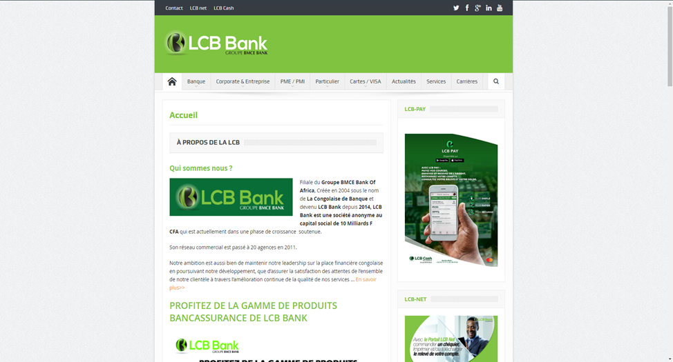
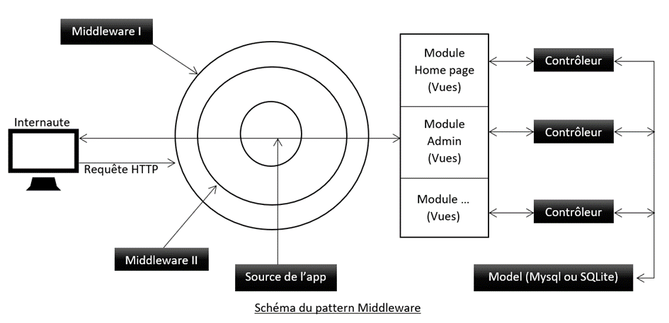
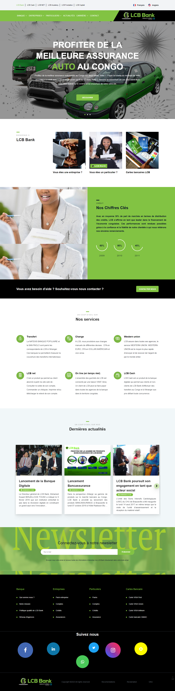

# Presentation du projet
Le cadre de l’activité bancaire s’est élargi et recomposé, grâce notamment à l’avènement d’internet et l’apparition des banques en ligne. Le secteur bancaire est leader dans l’usage des technologies d’information et de la communication. Ces technologies ne peuvent plus être considérées comme un simple outil d’amélioration de la productivité, elles accélèrent la réorganisation interne de la banque et ses relations avec la clientèle. Ainsi, un site internet constitue une de ces stratégies « multi-canal » qui impose, d’une part, une nouvelle perception de son image et d’autre part, déplace la concurrence sur le terrain de l’innovation et la maîtrise des technologies d’informations et de communication afin de mieux répondre aux besoins et aux exigences de la clientèle. Et par la même occasion, un site internet permet de conquérir de nouveaux marchés, d’accroitre la demande et d’améliorer la qualité des relations avec la clientèle.

# Objectif du projet
L’objectif est triple : d’abord représenter la banque sur internet avec des pages ergonomiquement mieux constituées que les pages existantes, ensuite, fidéliser les clients actuels et enfin, acquérir de nouveau clients. Lorsque le client est capté, la banque cherche à le garder, le faire revenir et le faire agir sur son site et ainsi créer un maillage virtuel.

# Etat de l'existant
Le site (lcb-bank.com) existant est un site WordPress. Je n’ai jamais été en contact du code de ce site et la page d’accueil se présente comme ceci :

# Mission
Le directeur de la DOSI, chef de projet, m’a donné pour mission d’améliorer l’ergonomie des pages de lcb-bank.com tout en gardant en grande parti le contenu du site, d’ajouter le rendu des pages en anglais et de les rendre modifiables (contenu modifiable en temps voulu). Parmi les résultats attendus par le chef de projet :

- Site internet haut de gamme, séduisant, interactif et dynamique,
- Navigation moderne et intuitive,
- Site évolutif, tant au niveau graphique que technique, sans remise en cause lourde,
- Respect des normes W3C,
- Site rapide au niveau de chargement de ses pages,
- Site en Responsive Design : site adaptable pour tous types d'ordinateurs, tablettes tactiles, et smartphones,
- Amélioration de visibilité.

# Choix de technologies
| Technologies                                                                     | Logitiel Utilisé | Raison                                                                                                                                                                                                                                                                     |
|----------------------------------------------------------------------------------|-----|----------------------------------------------------------------------------------------------------------------------------------------------------------------------------------------------------------------------------------------------------------------------------|
| PHP (Hypertext Preprocessor) version 7.4                                         |    Visual Studio Code, PHPStorm | Le choix de PHP n’est apparu naturel c’est un langage principalement utilisé pour produire des page web dynamique. Contrairement à d’autre langage où il faut forcement se tourner vers un Framework (Django pour Python, JavaEE ou Spring pour Java…)                     |
| MYSQL (SGBDR gratuit attribué sous licence GPL appartenant à Oracle) version LTS |  Mysql Workbench, Cmder, Powershell, Mysql Terminal, PHPStorm   | Car gratuit et tout simplement le système de gestion des bases de données le plus utilisé sur le web.                                                                                                                                                                      |
| Composer                                                                         |  Cmder, Powershell, PHPStorm   | Gestionnaire des dépendances de PHP                                                                                                                                                                                                                                        |
| SQLite (bibliothèque écrite en C qui propose un MBDR accessible par le langage SQL)                                                                            |  DB Browser for SQLite, PHPStorm   | Utilisé pour Absence du schéma client-serveur, directement intégré aux programmes et à l’avantage de rendre les données très rapidement. Très utilisé dans les applications téléphoniques et sur le web pour le cache.                                                     |
| JavaScript                                                                            |  Visual Studio Code, PHPStorm   | JavaScript est un langage de programmation interprété qui est pour le moment incontournable pour une ergonomie avancée des pages web et surtout pour leur interactivité (Tout ce qui est animation, effet spéciaux…).                                                      |
| HTML (Hypertext Markup Language), CSS (Cascading Style Sheets)                                                                            |  Visual Studio Code, PHPStorm   | HTML car c’est le langage de balisage le plus utilisés (Sinon pas le seul car le XHTML est une technologie morte depuis 2009) pour représenter les pages web. CSS car c’est le langage (et seule technologie pour l’instant) qui décrit la présentation des document HTML. |
| SASS (Langage dynamique de génération de feuille CSS)                                                                            |  Visual Studio Code, Cmder, Powershell, PHPStorm   | Car utilise le SassScript qui est un langage de description compilé en CSS. Il permet d’écrire plus rapidement du CSS compilé, d’imbriqué les connecteurs et les propriétés CSS et de générer dynamiquement des feuilles CSS.                                                                                                                                                                                                                                                                         |

# Travail Effectué
J’ai commencé le développement de la nouvelle version de lcb-bank.com par la mise en place d’un système de Router (Back-end). J’ai opté pour le design pattern des middlewares c’est-à-dire des garde-fous qui traitent chaque d’étape de la vérification d’une requête http.

Le design pattern Middleware consiste à mettre des garde-fou (middleware) lors du traitement d’une requête http pour s’assurer que la requête soit autorisée. La requête passe un certain nombre de middlewares jusqu’à atteindre la source de l’application. Lorsqu’elle atteint la source, cela signifie que cette requête à été autorisée. Elle est alors dirigée vers une des modules autorisés de l’application ensuite le pattern MVC traditionnelle s’effectue c’est-à-dire un contrôleur qui attaque le model et renvoi une vue de ce module mise à jour.

# Arborescence du site
J’ai élaboré l'architecture du site qui permettra de définir la structure du contenu. Ce travail essentiel visait à organiser le site pour : 
- Facilité et fluidifié la navigation par la prise en compte des habitudes de navigation de l'utilisateur final. 
- Hiérarchiser les contenus.

L’objectif permanent fut de rendre service à l’utilisateur final, c’est-à-dire le super administrateur du site.  
Les théories ergonomiques, graphiques et technologiques sont confrontées à la réalité. Je les adapte aux besoins exprimés et aux comportements observés. La seule sanction positive, c’est la satisfaction de l’utilisateur final en lien avec ma stratégie.

# Rendu


# Procedure d'installation

- Version PHP compatible : 7.4.x
- Module PHP à compiler et activer 
  - curl 
  - ftp 
  - fileinfo 
  - gd2 
  - mbstring 
  - odbc 
  - openssl 
  - pdo_mysql 
  - pdo_sqlite 
  - sqlite3
- Server Apache 
  - Chemin par défaut: ./www/ 
  - Chemin du livrable: ./www/LCB-website/ 
  - Point d’entrer du site: ./www/LCB-website/public/ 
  - Fichier pour redirection “.htaccess“: ./www/LCB-website/public/.htaccess
- Database:  
```php
'mysql' => [
    'dbname'    =>  'lcbwebsite_main_db',
    'host'      =>  'localhost',
    'username'  =>  'root',
    'password'  =>  'password',
    'port'      =>  '3308'
]
```
Changer par rapport aux configs du server db à utiliser.
